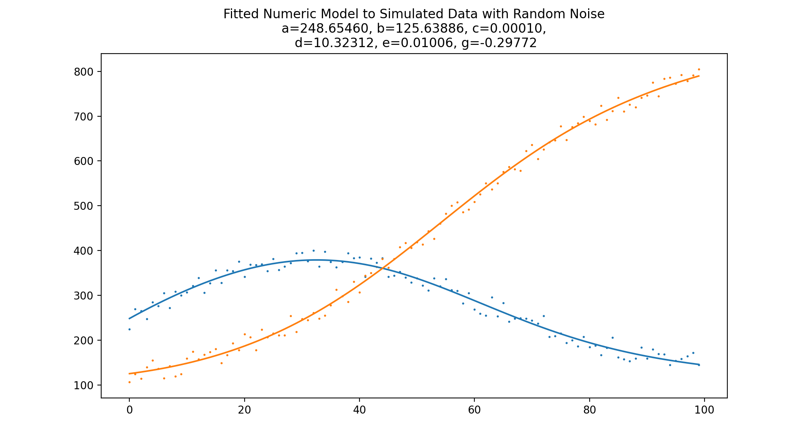
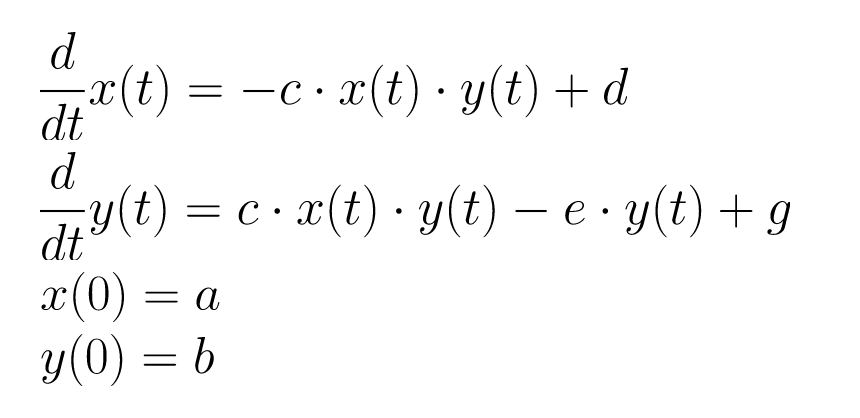

# ODE System Fitting with Boost and NLopt

This repository shows a simple example of using the [boost numerical integration toolkit](https://www.boost.org/doc/libs/1_77_0/libs/numeric/odeint/doc/html/index.html) combined with [NLopt](https://nlopt.readthedocs.io/en/latest/) to fit a system of ordinary differential equations to some noisy data.



## Example Model

The system used here for testing is a set of two ODEs and two initial conditions:



## Generating Data from the Model

The model is solved using [boost's numeric integration methods](https://www.boost.org/doc/libs/1_77_0/libs/numeric/odeint/doc/html/boost_numeric_odeint/odeint_in_detail/integrate_functions.html).  This is done by first specifying the model as a class that can be passed into the `integrate` function:

```
class two_eqn_model {
    model_params_t m_params;
    
public:
    explicit two_eqn_model( model_params_t params ) : m_params(params) { }
    void operator() ( const state_type &x , state_type &dxdt , const double /* t */ )
    {
        dxdt[0] = -m_params.c * x[0] * x[1] + m_params.d;
        dxdt[1] = m_params.c * x[0] * x[1] - m_params.e * x[1] + m_params.g;
    }
};

...
state_type x(2);
x[0] = params.a;
x[1] = params.b;
two_eqn_model model(params);
integrate( model , x , 0.0 , data->t[ii] , 0.1 );
```

Note that this class is parametrized with `model_params_t`, a struct containing the model parameters `a`, `b`, etc., so the minimization algorithm can search the parameter space while maintaining conformance with `boost::numeric::odeint::integrate`'s expected function prototype.

## Fitting the Model to Data

To practice fitting the model, noisy data is generated by adding a simple uniform additive noise to data generated from a set of chosen model parameters.

To actually fit the model to this data, we first need an objective function that will be used to score the fit.  The optimization algorithm will scan the parameter space looking for the minimum of this objective function.  In the case of fitting the model, the objective function should take a set of parameter guesses, generate some data from them, and compute a statistic comparing how much error there is in the generated data as compared to the measurements.

```
double objective_function(unsigned n, const double *x, double *grad, void *extra_data)
{
    using namespace std;
    auto *extra = (objective_function_extra_t *) extra_data;

    model_params_t params = {
            .a = x[0],
            .b = x[1],
            .c = x[2],
            .d = x[3],
            .e = x[4],
            .g = x[5]
    };

    generated_data_t current_data;
    current_data.length = N;
    current_data.t = std::vector<double>(N);
    current_data.x = std::vector<double>(N);
    current_data.y = std::vector<double>(N);
    generate_simulated_data(&current_data, params);

    double sse = 0;
    double residual_x;
    double residual_y;
    for (int ii = 0; ii < current_data.length; ii++) {
        residual_x = current_data.x[ii] - extra->truth_data->x[ii];
        residual_y = current_data.y[ii] - extra->truth_data->y[ii];
        sse = sse + residual_x * residual_x + residual_y * residual_y;
    }
    extra->step_count++;
    return sse;
}
```